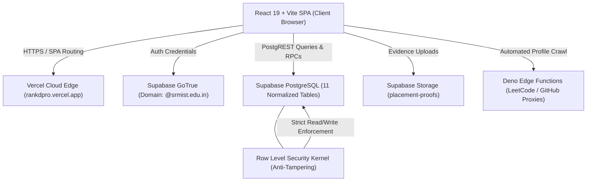

<div align="center">


# rankd

### *know your place.*

**Institutional Placement Readiness Evaluation & Real-Time Student Ranking Portal**  
*Engineered for SRM Institute of Science and Technology, Kattankulathur (SRMIST KTR)*

---

[](https://react.dev/)
[](https://vite.dev/)
[](https://tailwindcss.com/)
[](https://supabase.com/)
[](https://rankdpro.vercel.app)
[](https://opensource.org/licenses/MIT)

<br />

### 🌐 **[Launch Live Application: rankdpro.vercel.app](https://rankdpro.vercel.app)** 🚀

</div>

---

## 📖 Table of Contents
- [Overview](#-overview)
- [The 100-Mark Placement Scoring Rubric](#-the-100-mark-placement-scoring-rubric)
- [System Architecture](#-system-architecture)
- [Key Features](#-key-features)
  - [1. Student Self-Service Workspace](#1-student-self-service-workspace)
  - [2. Faculty Audit & Verification Ledger](#2-faculty-audit--verification-ledger)
  - [3. Live Deterministic Campus Leaderboard](#3-live-deterministic-campus-leaderboard)
  - [4. Automated LeetCode & GitHub Sync](#4-automated-leetcode--github-sync)
- [Security & Invariants](#-security--invariants)
- [Local Development Setup](#-local-development-setup)
- [Automated Test Suite](#-automated-test-suite)
- [Tech Stack](#-tech-stack)
- [Institution](#-institution)

---

## 🎯 Overview

Campus recruitment evaluation at premier engineering institutions traditionally struggles with fragmented Google Sheets, manual paper ledger reviews, unverifiable student claims, and delayed merit rosters.

**`rankd`** solves this by establishing a unified, tamper-evident scoring platform. It transforms how student placement readiness is evaluated by introducing:
- **A 100-mark dynamic placement readiness index** across 11 balanced academic, technical, and industry metrics.
- **Strict institutional domain & identity enforcement** (`@srmist.edu.in` and `RA2411` student registration numbers).
- **A multi-tenant workflow** separating student evidence submission from faculty verification.
- **Deterministic real-time ranking** with tie-breaking rules reflecting campus placement criteria.

---

## 📊 The 100-Mark Placement Scoring Rubric

The system implements the official SRMIST 100-mark placement readiness scoring framework across **11 distinct criteria**:

| # | Category | Max Marks | Key Criteria & Evaluation Bands | Verification Engine |
|---|---|:---:|---|---|
| **1** | **Academics & Foundation** | **15** | 10th (1.5m), 12th/Diploma (1.5m), Degree CGPA (12m based on CGPA >= 9.5, 9.0, 8.5, 8.0, 7.5 bands) | Transcript / Marksheet Proofs |
| **2** | **GitHub Portfolio** | **15** | Repository volume, commit frequency, contributions, star counts, open-source work | Live Profile Sync + Proof Link |
| **3** | **Coding Practice (LeetCode)** | **15** | Problems solved: 500+ (15m), 300+ (10m), 150+ (6m), 50+ (3m) | Direct LeetCode API / Edge Function |
| **4** | **Internships & Industry** | **10** | Tier-1 / MNC paid internships (10m), MSME / Startup (5–8m), Unpaid / Shadowing (2–4m) | Offer Letter & Completion Proof |
| **5** | **Skillset & Certifications** | **10** | Industry recognized: CCNA, CCNP, RedHat, IBM, NPTEL Elite, Coursera, MATLAB | Digital Credential / Certificate PDF |
| **6** | **Major / Minor Projects** | **10** | Production deployments, novel technical architecture, academic capstone projects | Hosted URL + Repository Link |
| **7** | **Full Stack Web/App Dev** | **5** | Production full-stack application with frontend, backend, database, and auth | Live Application URL + Repo |
| **8** | **Hackathons & Contests** | **5** | SIH / International / National Winner (5m), Runner-up (3–4m), Finalist (2m) | Participation / Winner Certificate |
| **9** | **In-House Research & Labs** | **5** | Departmental lab projects, published papers, faculty research assistance | Faculty Mentor Recommendation |
| **10** | **Professional Memberships** | **5** | IEEE, ACM, CSI, IET, ISTE active student memberships | Membership ID Regex + Chapter Ledger |
| **11** | **Standardized Assessments** | **5** | SHL, CoCubes, AMCAT, eLitmus aptitude percentiles | Official Scorecard Upload |
| **TOTAL** | **Placement Readiness Score** | **100** | **Sum of all 11 verified category marks (hard-capped at 100)** | **Faculty Audited & Approved** |

---

## 🏗️ System Architecture



### Architectural Highlights:
1. **Zero-Hardcoding Principle**: No student marks, profiles, submissions, or faculty accounts are hardcoded. Everything is dynamically persisted in PostgreSQL.
2. **PostgreSQL RLS Kernel Security**: Students can only insert submissions with `status = 'PENDING'`. Only verified faculty coordinators can transition records to `status = 'VERIFIED'` or award marks.
3. **Atomic Verification Transactions**: Faculty verification executes through PostgreSQL RPCs (`rpc_verify_submission` and `rpc_reject_submission`), executing the submission update, audit log creation, and student inbox notification in a single atomic transaction.

---

## ✨ Key Features

### 1. Student Self-Service Workspace
- **Real-Time Score Donut**: Instant visual feedback displaying Verified Points, Pending Claim Points, and Unclaimed Opportunities out of 100.
- **Dedicated 940px Metric Workspaces**: Custom, clean submission forms for every single category with live mark preview as the student fills out details.
- **Multi-File Evidence Uploader**: Drag-and-drop batch proof document upload supporting PDF, PNG, and JPG credentials stored securely in Supabase Storage.
- **Real-Time Feedback Inbox**: Instant notification stream displaying verified mark awards and faculty feedback notes.

### 2. Faculty Audit & Verification Ledger
- **Section-Based Student Mapping**: Faculty coordinators are dynamically mapped to students sharing their assigned section (e.g. `Section P1`, `Section A1`), with institutional overview modes for department heads.
- **Pending Verification Queue**: Real-time triage inbox displaying incoming student claims with one-click proof inspection (`📄 View Proof ↗`).
- **Interactive Student Metrics Inspector**: Coordinators can view every student's full 11-category rubric breakdown in read-only mode, with strict safeguards ensuring marks are only awarded through formal student requests.

### 3. Live Deterministic Campus Leaderboard
- Real-time ranking calculated directly from verified placement scores.
- **Deterministic Tie-Breaking**: When placement scores match, ranking automatically resolves by:
  1. Degree CGPA
  2. 12th / Diploma Academic Percentage
  3. 10th Academic Percentage
  4. Institutional Registration Number (`RA2411...`)
- **Continuous Evaluation**: Clean real-time placement score ranking and metrics based on verified claims across the 100-mark rubric.

### 4. Automated LeetCode & GitHub Sync
- Connects directly to LeetCode's public GraphQL API via serverless Edge Functions to retrieve real-time solved counts across Easy, Medium, and Hard problems.
- Automatically calculates and previews placement marks according to rubric thresholds.

---

## 🔒 Security & Invariants

- **Domain Restriction**: Authentication strictly enforces SRMIST email addresses ending in `@srmist.edu.in`.
- **Registration Format**: Student IDs are validated against official SRMIST matriculation format (`RA2411...`).
- **Password Policy**: Minimum 8 characters required without arbitrary complexity barriers.
- **Superseding Submission Pattern**: Submitting an updated claim for an already pending activity automatically supersedes older claims, preventing queue congestion and duplicate credit.
- **Credential Hygiene**: Git tracking strictly isolates all `.env` files and `.agents/` configuration tokens.

---

## 💻 Local Development Setup

### Prerequisites
- [Node.js](https://nodejs.org/) (v18 or higher recommended)
- [Git](https://git-scm.com/)

### 1. Clone the Repository
```bash
git clone https://github.com/abhaydasarathy/rankd.git
cd rankd
```

### 2. Configure Environment Variables
Copy the provided `.env.example` to create your local `.env`:
```bash
cp .env.example .env
```
Open `.env` and fill in your Supabase credentials:
```env
VITE_SUPABASE_URL=https://your-project-ref.supabase.co
VITE_SUPABASE_ANON_KEY=your-supabase-anon-key-here
```

### 3. Install Dependencies
```bash
npm install
```

### 4. Run Development Server
```bash
npm run dev
```
Open [http://localhost:5173](http://localhost:5173) in your browser.

### 5. Build for Production
```bash
npm run build
```

---

## 🧪 Automated Test Suite

`rankd` includes a comprehensive automated test suite validating the scoring engine across all boundary conditions:

```bash
node src/utils/scoringEngine.test.js
```

**Test Coverage (13 Suites Passing):**
- [x] Academics & CGPA Band Transitions
- [x] GitHub Score Invariants
- [x] LeetCode Solving Thresholds
- [x] Tier-1 vs Startup Internship Calculations
- [x] Certified Skillset Weighting & Multi-Cert Normalization
- [x] Major & Minor Project Caps
- [x] Full-Stack Live Production Architecture Scoring
- [x] Hackathon Win / Runner-Up / Participation Marks
- [x] In-House Research Lab Rubric
- [x] Professional Body ID Validation (IEEE, ACM, CSI, etc.)
- [x] Assessment Percentile Bands
- [x] Global 100-Mark Cap Enforcement
- [x] Academics Downward Revision & Marks Adjustment Flow

---

## 🛠️ Tech Stack

- **Frontend**: [React 19](https://react.dev/), [Vite 8](https://vite.dev/), [React Router DOM v7](https://reactrouter.com/)
- **Styling**: [Tailwind CSS v4](https://tailwindcss.com/), CSS Custom Properties (Theme Engine)
- **Icons**: [Lucide React](https://lucide.dev/)
- **Database & Auth**: [Supabase](https://supabase.com/) (PostgreSQL 15+, GoTrue Auth, Realtime, Storage)
- **Deployment**: [Vercel](https://vercel.com/) (SPA Wildcard Rewrites via `vercel.json`)
- **Linting**: [Oxlint](https://oxc.rs/)

---

## 🏛️ Institution

Developed for **SRM Institute of Science and Technology**, Kattankulathur Campus (KTR), Tamil Nadu, India.

---

<div align="center">
  <sub>Built with ❤️ for SRMIST Placement Cell & Engineering Students</sub>
</div>
